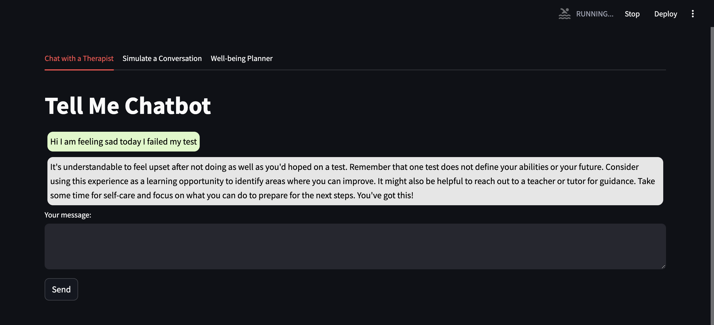
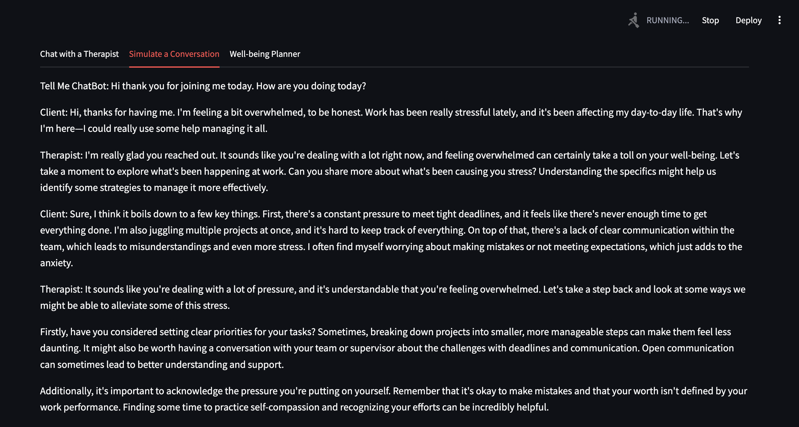
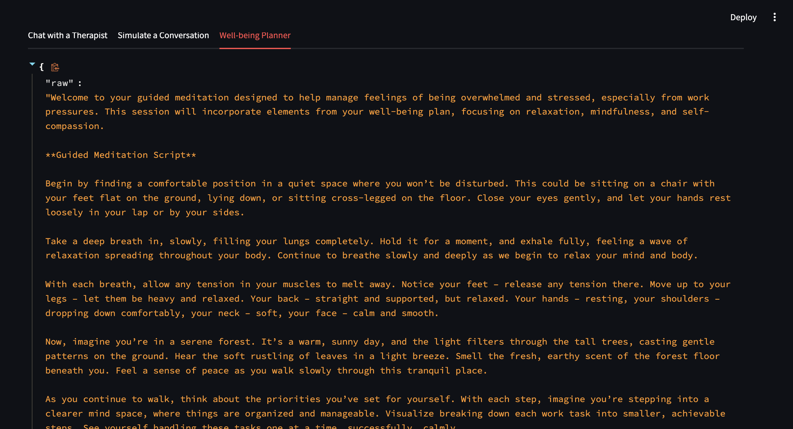
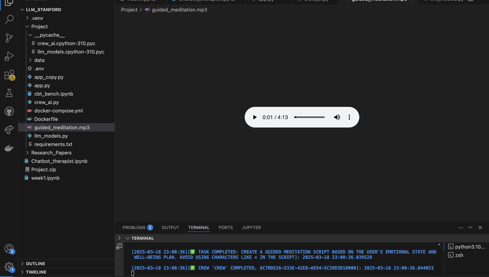

# Tell_Me_Chatbot

## Description:
Tell Me Chatbot is a Mental Well-being chatbot serving as a proxy to provide initial therapeutic care to Clients. The core of the bot is LLM's giving choice to the developers to use local models like llama2 or even utilize GPT 4. The experiment is utilize methods like RAG, Langchain and Crew AI Agents to provide a comprehensive platform for care.
***Note: This chatbot provides only the initial care and no claims have been made to replace actual human care in Cognitive Behavioural technique etc.
*** The project is still under construction. Have not got much time to fine tune the project. But will continue working on this as personal project

# Components of the Project:

1. Tell_Me Chatbot Live (Chat with a Therapist Tab): This feature uses the RAG Methodology with the help of llama_index. We are using the Mental_Health context and responses from the hugging face data for mental well-being: Amod/mental_health_counseling_conversations https://huggingface.co/datasets/Amod/mental_health_counseling_conversations . We are using this data as a index, the embedding is done by model_name="BAAI/bge-small-en-v1.5" and then using a retriever we are finding out the top 3 ideal responses for the input provided by the Client and finally using RetrieverQueryEngine we are providing a response. Other functionality includes we are using a separate LLM to check for sentiment of the Client response. In-case the Client responses are out of scope of the model, they will be directed to a default message for helpline number. 

2. Simulate a Conversation: We are utilizing two LLM models. One LLM serves the role of Therapist and another as a potential Client. We are letting the LLM's have a conversation. The context of the Client is provided through a prompt. I am working on providing users the ability to write their own prompt and in future a download option so that one can have enough data in future to train a Model. Something about comparing the results between actual therapist data fine tune model and simulated therapist data fine tuned model

3. Well-Being Planner: Using Agentic AI and with the help of Crew AI we have 3 Agents. Transcript_Analysis Agent that Analyzes the client's chat with the AI therapist to extract emotions, key concerns, and sentiment trends. Plan Generator Agent that Creates a personalized 1-week plan with activities, exercises, and affirmations. And Meditation Audio Agent that Creates a guided meditation script and generates an audio file for relaxation.

4. Streamlit: For front end we are going to use Streamlit. I have made a basic skeleton of the UI. Need more time to improve it.






I will keep on going to work on this project. This project is my submission for the Tech16: Large Language Model for Business Coursework at Stanford. 

## How to run
streamlit run app.py

further configurations like required libraries and config will be provided in future.

## Citation
If you are using this code please cite me.

```bibtex
@misc{Ahalpara2025,
  author = {Trishala J. Ahalpara},
  title = {Tell_Me Chatbot},
  year = {2025},
  howpublished = {\url{https://github.com//trystine/Tell_Me_Chatbot}},
  note = {Version 1.0}
}
